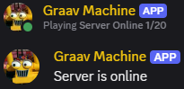

# GraavMachine

Graav Machine is a simple but effective Discord bot that checks if a Minecraft server is online, and the amount of players currently playing. It also sends messages to a channel when the server goes online and offline.

## Usage
- Download and compile this for your desired platform. There is a Build.bat file to create a linux build.
- In the place you want to host, create an appsettings.json file and add the following:
```json
{
  "MinecraftServer": {
    "Ip": "127.0.0.1",
    "Port": 25565
  },
  "Discord": {
    "Token": "XXXXXXXXXXXXXXXXXXXXXXXXXXXXXXXXXXXXXXXXXXXXXXXXXXXXXXXXXXXXXXXXX",
    "ChannelID": "00000000000000000"
  }
}```
- Replace the settings to your needs.
- Happy botting!


